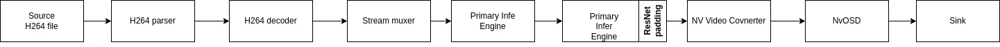

# Image classification
This should be the very first app you run in deepstream. Currently, output between TensorRT and Pytorch is a bit different. I'm checking it. It could be due to net-scale-factor + offset. 

## Prerequisites
- Basic python programming
- Basic deep learning understanding
- Basic resnet input+output understanding

## How to run
### Convert pytorch model to onnx format
```
docker run --rm -it --name tmp_ctn --gpus=all --shm-size 8G --network host --volume="$PWD:/workspace/" -w /workspace/ nvcr.io/nvidia/pytorch:25.04-py3 python get_onnx_file.py
```
There should be a `resnet18.onnx` file in this folder 
### Generate TensorRT engine file
Generate TensorRT engine with command
```
docker run --rm --name ds_tmp_ctn \
--gpus=all \
--shm-size 8G \
--network host \
--volume="$PWD:/workspace/" \
-w /workspace/ ds70_img:latest \
trtexec --onnx=resnet18.onnx \
--minShapes=input:1x3x224x224 \
--optShapes=input:16x3x224x224 \
--maxShapes=input:32x3x224x224 \
--fp16 \
--saveEngine=resnet18.engine
```
There should be a `resnet18.engine` file
### Run the program
Because we want to show output video, so we run in interactive mode:
```
cd .. && docker run --rm -it --name deepstream_ctn --gpus=all --shm-size 8G --network host -v /tmp/.X11-unix:/tmp/.X11-unix -e DISPLAY=$DISPLAY -e CUDA_CACHE_DISABLE=0 --env="QT_X11_NO_MITSHM=1" --volume="$PWD:/workspace/" -w /workspace/ ds70_img:latest /bin/bash
```
Open other terminal, expose to show output video. Warning, from what I read, this isn't secure. But I don't know other way, so do it at your own risk. 
```
docker ps | grep "deepstream_ctn" | awk '{ print $1 }' | xargs -I {} sh -c "xhost +local:{}"
```
Back to previous terminal, we use sample video from deepstream. We can use generated tensorrt infer engine 
```
python im_cls.py --pgie_type nvinfer --input_video /opt/nvidia/deepstream/deepstream/samples/streams/sample_720p.h264
```

Or we can use triton server. This would allow us to use  pytorch or TensorRT
```
python im_cls.py --pgie nvinfer-server --input_video /opt/nvidia/deepstream/deepstream/samples/streams/sample_720p.h264
```

If you want to run with your own video, encode it to h264 format as in [videoio](https://github.com/vguzov/videoio)

## Explain
### Config file

While most of config is self-explained, there is a few not so obvious for beginner. 

`[property]` : This is to define the properies of the infer engine. Input shape, output mode, etc are defined in here

`net-scale-factor` and `offsets`: Because neural network usually is trained with normalized input (ie: scale to range [0, 1], subtract mean and divide std), output of deepstream decoder is array in range [0, 255], we need to scale input. [Guide line for these 2 numbers](https://forums.developer.nvidia.com/t/how-to-calculate-net-scale-factor-and-offset/270357)

`gie-unique-id`: This is an ID to infer engine, we number them from 1, 2,...

`process-mode`: for gst-infer, we have 3 modes
mode 1: infer on full frame. This is used for primary infer engine (pgie).
mode 2: infer on cropped ROI. This is used for secondary infer engine (sgie) that process on output of primary infer engine. Ie: pgie is an object detector, sgie is classifier, classify detected object 
mode 3: infer on preprocessed input tensor. This is used when infer engine require specific preprocess.

`output-tensor-meta`: we need this to get output tensor for further process.

Other is in the config file.
### Output parser
Output of resnet is a vector 
